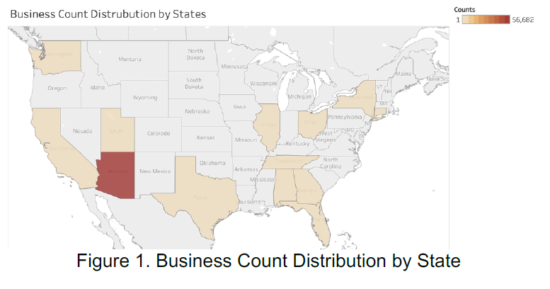
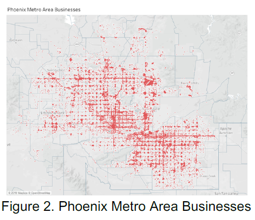
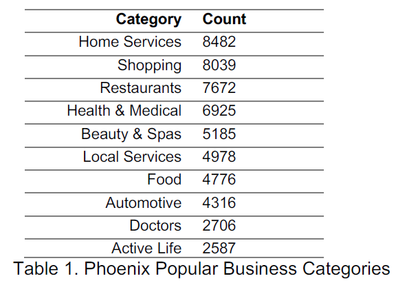
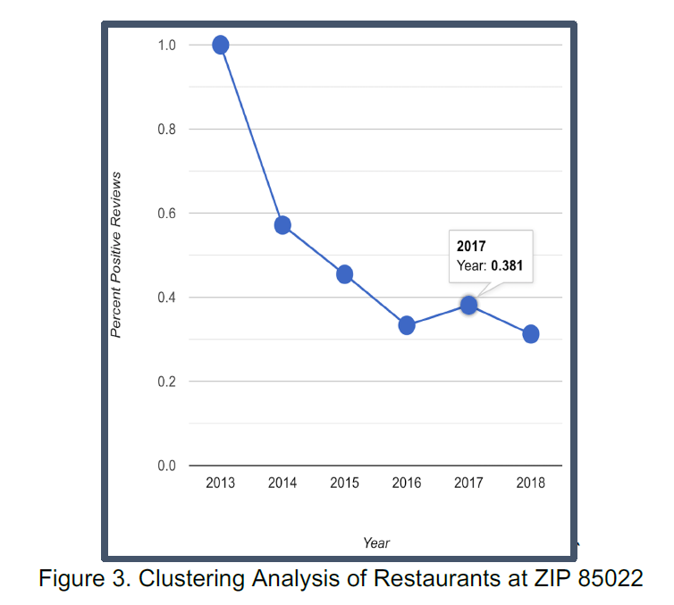
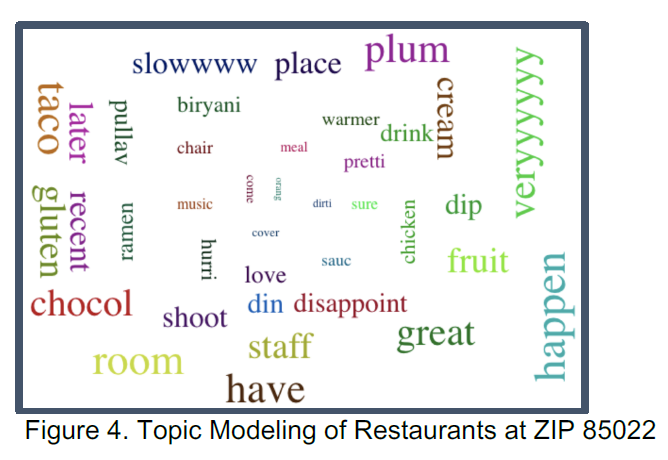
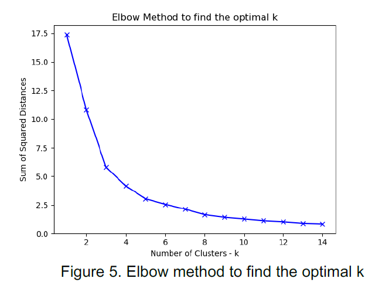
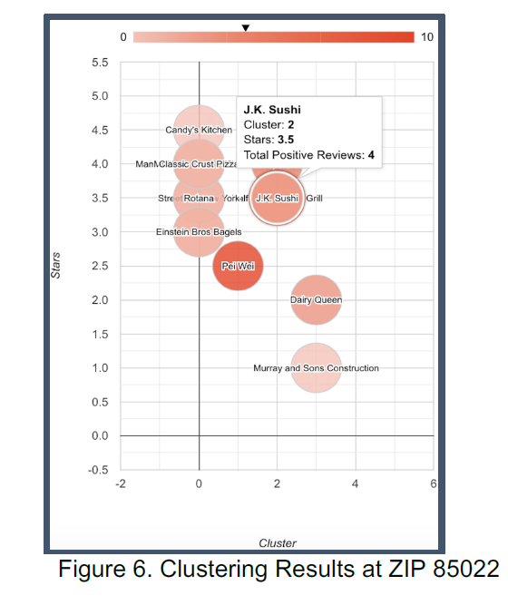
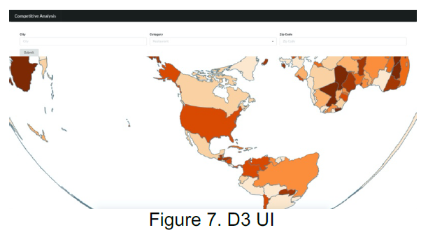
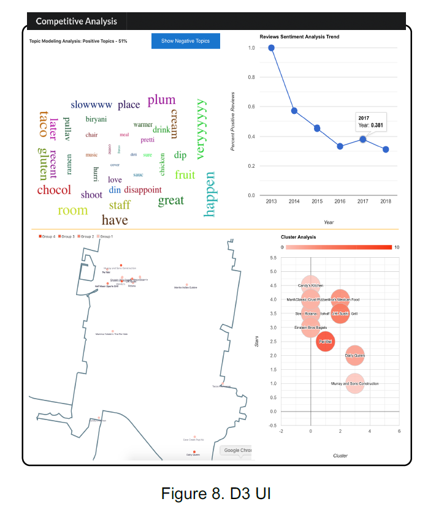
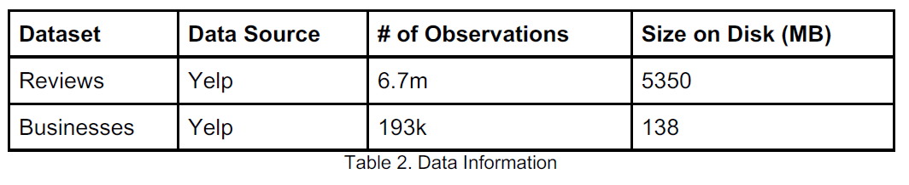

Team: Aditi Shetty, Caleb T. Olson, Chowjanya Kandasamy, Luka Ralic, Weichao Wang

# Abstract
  Investors and business owners often possess subjective and biased personal knowledge of opportunities and needs for services in a particular location or region. Especially in this day in age, businesses are striving to be driven more and more by
data, rather than intuition or potentially naivety. To better equip existing and prospective business owners with data-driven decisions, we introduce a system that leverages big
data to predict the point in time quality, or lack thereof, of business opportunity in a given domain. The system is largely supported by Yelp data for historical patterns and
applies art big data techniques to clean, process, and produce insights into the point in time quality of a user-provided industry or service. Phoenix area is selected as the
target to study the feasibility to better make decisions driven by state-of-the-art statistical techniques applied to their target business domain.

# Introduction
  Yelp has been a phenomenon as it bridges the gap between the restaurant and the food seekers. It is our daily life to use Yelp to find varieties of foods. As little exploration is done on 1) other services such as auto repair, movers, etc., 2) How to
advance new invertor’s situation to open businesses at the desired location. The team proposes solutions for business investors to find an ideal location to open a business with data-driven decisions. Today, the location search is done either by manual surveys
or models based on census data [12], good visualization can be beneficial and convenient for an investor. Our work is based on mature models and visualized conveniently for customers. It will be successful as the traditional methods limit people’s
sights and query inefficiently.

  An obvious way to find a business is to use rankings [5]. Liu et al [8] presented classification-based algorithms. His approach brings the potential possibility of sentiment analysis and rank locations based on ratings, reviews, etc. This approach
may lack any other factors impact. Similarly, Li et al [1] and Dai et al [2] also investigated the reviews in depth Approaches such as sentimental analysis and review weight are tried for rankings. We can use these to create business rankings accurately
and based on key factors. The proposed models lack stronger exploration, which is planned to be experimented and extended in the project. Kouvaris et al [9], as well discussed sentimental analysis, but by multiple algorithms. Natural language models
are explicitly used for Yelp analysis. The team can be benefited in terms of algorithm insights. Yet, the implementation of algorithms is not covered and need to be tried. Karamshuk et al [10] studied multiple machine learning features on the popularity of
retail stores through the use of datasets from Foursquare in NYC. The team will mine data based on geographic and user mobility. Location details from the business details dataset can be used, however, data such as check-in data is not available from the Yelp
API. Potential solutions are to utilize the static dataset or other related social mediabased API. Portugal et al [6] presented a machine learning case as well for us for reference. The algorithm will need to be detailed. In Glaeser et al’s work[11], the
relationship between businesses and changes in neighborhoods is studied. This work will help us experiment with the algorithm behind the business location calculation.
  
# Methodology
  The popularity of a business category among local consumers plays a key role in recommending an ideal business location. Our goal is to find locations that have the most potential to attract customers.
  
  ## Data Collection
  Yelp dataset (business, users, reviews, check-ins) is used as the main source of data for analysis. From the dataset, business.json contains information such as business name, ID, latitude, longitude, state, etc. In order to demonstrate our project analysis, Phoenix metro area is selected for detailed analysis due to its abundancy in business counts and types. (latitude >= 33.2053083226 & latitude <= 33.8489465375, longitude >= -112.5421815 & longitude <= -111.6003941)
  
  
 
  

  Table 1 presents the most popular categories within the Phoenix area and these categories will work as a “suggestion list” in the final UI presentation. This work is done
by funneling data using OpenRefine.

  

  To rank a location in a category, we will couple the two sets of data for analysis. Lin et al [7] present a system recommending geographical zones to host business in. By
inputting business category and description, the system produces a ranked list of zones, represented as a geographical heatmap. A ranking system could be useful in identifying
areas with the most potential for improvement. This system is focused specifically on Singapore. As an improvement, we will expand to any geographical location.

  ##  Sentiment Analysis
  This project explores the use of sentiment analysis to develop business insights and support decision making. One paper outlined the process of conducting product opinion mining through sentiment analysis [13]. This paper was helpful for this project,
because it detailed multiple approaches to sentiment analysis. The paper falls short in how to visualize this information and present it to an aspiring business owner. The team decided to utilize a sentiment analysis model, VADER, based on the
research paper “VADER: A Parsimonious Rule-based Model for Sentiment Analysis of Social Media Text” [14]. This paper is useful to the project, because it compared VADER to multiple sentiment analysis models and techniques finding that, in most
cases, VADER resulted in the best performance [14]. We plan on improving upon this work by adding in the change in sentiment over time to provide end users with a trend analysis.

    
 Another paper explored creating visualizations for sentiment analysis including visualizing information about the person who produced the text such as age, attitude,
etc [16]. This paper is useful for this project, because it provides interesting visualizations for specific characteristics of a person. This project will expand upon this
by applying the concept to words that appear most in negative reviews to provide insights to the end user. The paper, “Towards Extracting Coherent User Concerns and 
Their Hierarchical Organization from User Reviews”, provides a method for “mining user reviews to discover what the user likes and dislikes” [15]. This paper is useful, because
it provides a mechanism for topic modeling, but falls short in providing a visualization for end users. This project will expand upon the paper by creating an interactive
visualization to help end users gather insights through review data. 

  ##  Topic Modeling
  In an effort to further provide data driven insights that support identification of business opportunity, we decided to apply topic modeling techniques to the data that
has been processed for sentiment. We are currently leveraging Latent Dirichlet Allocation, which enables the identification of abstract topics that appear across a body
of documents. We are presenting the topics discovered by LDA, in both the positive and negative review bodies, to the end user. This enables the end user to potentially identify common complaints and exploit those in future business endeavors. [17]

 

  ##  Clustering
  We have used KMeans clustering to group similar businesses together. It partitions a set of observations into the specified number of clusters. In order to identify
the most popular businesses in a location, we make use the following observations with respect to a business:
      * Total number of positive reviews
      * Total number of reviews
      * Average star rating
      
  We filter the data based on zip code and category, then calculate the optimal number of clusters for that dataset using the elbow method [19].
  
  
      
  The chart above represents the elbow criteria for postal code 85085 (in Phoenix, AZ) and category ‘Restaurants’. The plotted line is shaped like an arm and the elbow on
this arm is the optimal value of k - the optimal value of ‘k’ here is found to be 4. Ferreira et al [18] state that KMeans does not give an optimal set of clusters. We overcome this by calculating a ‘k’ value separately for each data (based on category and postal code). Using all the above information we perform KMeans clustering and retrieve the clusters.
We identify two clusters with the maximum values of total number of positive reviews, review count and average star rating. Using the business data from the selected two
clusters, we will rank the popular business based on the above metrics.

  

  ##  Visualization
  The default view will showcase a Phoenix map for top 5 businesses with the selected business category. A resulting map of the area within specified radius will show
the number of popular business in the specified category, running in the area ordered by popularity. Wang et al [3] and Xuan et al [4] focused on geographic location data and
visualization can be leverage by our project. We intend to expand the usage of radius setting and geographic visualization to assist our project.

  ##  Innovation
   * Combination of sentiment analysis and topic modeling helps gain insights into consumer preferences without the need for extensive research.
   * Providing the ability to visualize the competitive landscape at the zip code level makes it easy to identify undeserved areas and communities.
   * Clustering analysis based off of star rating and positive reviews helps to validate the level of competition in a market.
  
# Results
  As presented by Figure 7, the UI has been designed using D3. City, Category and Zip Code are the three areas that can be input in the boxes to investigate the
businesses opened in the corresponding area. By experimenting with restaurants in Phoenix at zip code 85022, The topic modeling, clustering analysis, sentimental
analysis are combined and presented in a compact visualization as shown in Figure 8. From the topic modeling section, the customer will be able to see the positive or
negative topics that are popular from the business reviews. It is important to know what the customers’ impression on the business and what can be improved in future.
The sentimental analysis section presents the overall positive review ratio over the years. This information indicates the business performance trend over time. This is
crucial for a potential business investor to know if there can be potentials to open new business in the certain category. By utilizing clustering analysis, a total number of 4 tiers will be grouped among the businesses shown in the map, as well as compared by ratings. This can help us understand the high-level picture of the businesses in the selected area.

# Data Source
  The application is dependent on the Yelp JSON dataset. Statistics on the static dataset can be found in the table below.
  

  
# Cost
  Tableau Creator will be used to create and host the data visualizations. This cost is $70 per month for two months at a total of $140.00. In addition, Five developers will
contribute to the project for a total of 500 hours at a billable rate of $0.00 dollars.

# Conclusion and Discussion
  Traditional recommendation systems determine the popularity of a geographical zone based on the success of current businesses. Our application will identify zones
which have a potential for improvement due to lack of service or competition for categories. We used Tableau to filter out the data for research area selection and business
concentration. As a result, Phoenix is chosen with top business categories. Then we used VADER sentiment analysis to classify the positive/negative reviews for each
business and joined with the business information. LDA topic modeling and K-means clustering are used to present the local hot topics for a certain business category,
together with the assessment of the local business performance. Python has been used to join all the business and the review data together. Then a subset of data from Phoenix is created for experiment and evaluation. D3 is used to
present the data interactively on a web page. By selecting the city name, category name and zip code, corresponding competitive analysis will automatically be executed.

# Reference

[1] Li, Hengyun, et al. “Making Restaurant Reviews Useful and/or Enjoyable? The Impacts of Temporal, Explanatory, and Sensory Cues.” International Journal of
Hospitality Management, 14 Nov. 2018, doi:10.1016/j.ijhm.2018.11.002.

[2] Dai, Weijia, et al. “Aggregation of Consumer Ratings: an Application to Yelp.com.” Quantitative Marketing and Economics, vol. 16, no. 3, 2017, pp. 289–339.,
doi:10.1007/s11129-017-9194-9.

[3] Wang, Yong, et al. “Towards Easy Comparison of Local Businesses Using Online Reviews.” Computer Graphics Forum, vol. 37, no. 3, 2018, pp. 63–74.,
doi:10.1111/cgf.13401.

[4] Xuan, Qi, et al. “Modern Food Foraging Patterns: Geography and Cuisine Choices of Restaurant Patrons on Yelp.” IEEE Transactions on Computational Social Systems, vol.
5, no. 2, 2018, pp. 508–517., doi:10.1109/tcss.2018.2819659.

[5] Do, Opeke, Rotimi, Webb, James. “CS224W Final Project: Predicting Yelp Ratings From Social Network Data.”, 2015

[6] Portugal, Ivens, et al. “The Use of Machine Learning Algorithms in Recommender Systems: A Systematic Review.” Expert Systems with Applications, 2018, doi:
10.1016/j.eswa.2017.12.020

[7] Lin, Jovian & Oentaryo, Richard & Lim, Ee-Peng & Vu, Casey & Vu, Adrian & Kwee, Agus & Prasetyo, Philips Kokoh, A Business Zone Recommender System Based on
Facebook and Urban Planning Data. 9626. 10.1007/978-3-319-30671-1_47, 2019

[8] Liu, Tie-Yan. “Applications of Learning to Rank.” Learning to Rank for Information Retrieval, 2011, pp. 181–191., doi:10.1007/978-3-642-14267-3_14.

[9] Kouvaris, Peter; Pirogova, Ekaterina; Sanadhya, Hari; Asuncion, Albert; and Rajagopal, Arun, "Text Enhanced Recommendation System Model Based on Yelp
Reviews," SMU Data Science Review: Vol. 1 : No. 3 , Article 8, 2018

[10] Dmytro Karamshuk, Anastasios Noulas, Salvatore Scellato, Vincenzo Nicosia, Cecilia Mascolo, “Geo-spotting: mining online location-based services for optimal retail
store placement”, 2013

[11] Glaeser, Edward L., Hyunjin Kim, and Michael Luca, "Nowcasting Gentrification: Using Yelp Data to Quantify Neighborhood Change." AEA Papers and Proceedings,
108: 77-82, 2018

[12] Mengwen Xu, Tianyi Wang, Zhengwei Wu, Jingbo Zhou, Jian Li, Haishan Wu, “Store Location Selection via Mining Search Query Logs of Baidu Maps”, 2016

[13] Amarouche, Kamal, et al. “Product Opinion Mining for Competitive Intelligence.” Procedia Computer Science, vol. 73, 2015, pp. 358–365.,
doi:10.1016/j.procs.2015.12.004.

[14] Hutto, C. J., and Gilbert, E., “VADER: A parsimonious rule-based model for sentiment analysis of social media text” ICWSM, 2015

[15] Pradhan, Ligaj, et al. “Towards Extracting Coherent User Concerns and Their Hierarchical Organization from User Reviews.” 2016 IEEE 17th International Conference on Information Reuse and Integration (IRI), 2016, doi:10.1109/iri.2016.85.
[16] Wang, Changbo, et al. “SentiView: Sentiment Analysis and Visualization for Internet Popular Topics.” IEEE Transactions on Human-Machine Systems, vol. 43, no. 6, 2013, pp. 620–630., doi:10.1109/thms.2013.2285047.

[17] Blei, David, Ng, Andrew, Jordan, Michael,“Latent Dirichlet Allocation”, 2003

[18] Ferreira, Vinícius &amp; Valejo, Alan &amp; Valdivia, Paola &amp; Valverde-Rebaza, Jorge, “Exploiting Geographical Data to improve Recommender Systems for Business Opportunities in Urban Areas.” BRACIS 2019 ,2019

[19] Bholowalia, Purnima and Ashok Kumar. “EBK-Means: A Clustering Technique based on Elbow Method and K-Means in WSN.”, 2014.
